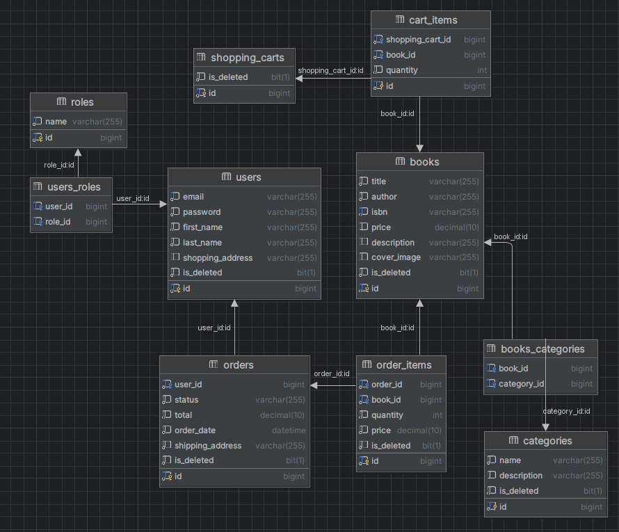

# **📚Online Book Store Project**

Welcome to the Online Book Store project! This project is a Java-based web application built using Spring Boot, Hibernate, Liquibase, and other technologies to create a robust online bookstore.

## **Table of Contents**
1. ### [📝Introduction](#1-introduction)
2. ### [💻Technologies Used](#2-technologies-used)
3. ### [💾Database structure](#3-database-structure)
4. ### [🏁Getting Started](#4-getting-started)
5. ### [📃API Documentation](#5-api-documentation)
6. ### [🪪Security](#6-security)

## **📝1. Introduction**

This project is an online bookstore that provides a platform for users to explore and purchase books. It is built using Java with the Spring Boot framework, utilizing technologies like Hibernate for database interaction, Liquibase for database versioning, Swagger for API documentation, and JWT for secure user authentication.

## **💻2. Technologies Used**
* Java
* Spring Boot (Web, JPA, Security)
* Hibernate
* Liquibase
* Swagger
* Pagination

## **💾3. Database structure**

User Features  
&emsp;Shopping Cart: 
&emsp;&emsp;Add books to the shopping cart 
&emsp;&emsp;Create cart items 
&emsp;&emsp;Update shopping cart contents 
&emsp;Orders: 
&emsp;&emsp;Create orders from the shopping cart 
&emsp;&emsp;View and track order status 
&emsp;Viewing: 
&emsp;&emsp;Get a list of all categories 
&emsp;&emsp;Get a list of all books 
&emsp;&emsp;Filter books by categories 
Admin Features 
&emsp;Book Management: 
&emsp;&emsp;Create new books 
&emsp;&emsp;Update existing books 
&emsp;Category Management: 
&emsp;&emsp;Create new categories 
&emsp;&emsp;Update existing categories 
&emsp;Order Management: 
&emsp;&emsp;Update user order statuses 

## **🏁4. Getting Started**
To run the project locally, follow these steps:

## **📃5. API Documentation**

## **🪪6. Security**
The project uses JWT tokens for secure user authentication. Make sure to include the token in the headers of your requests for authorization.